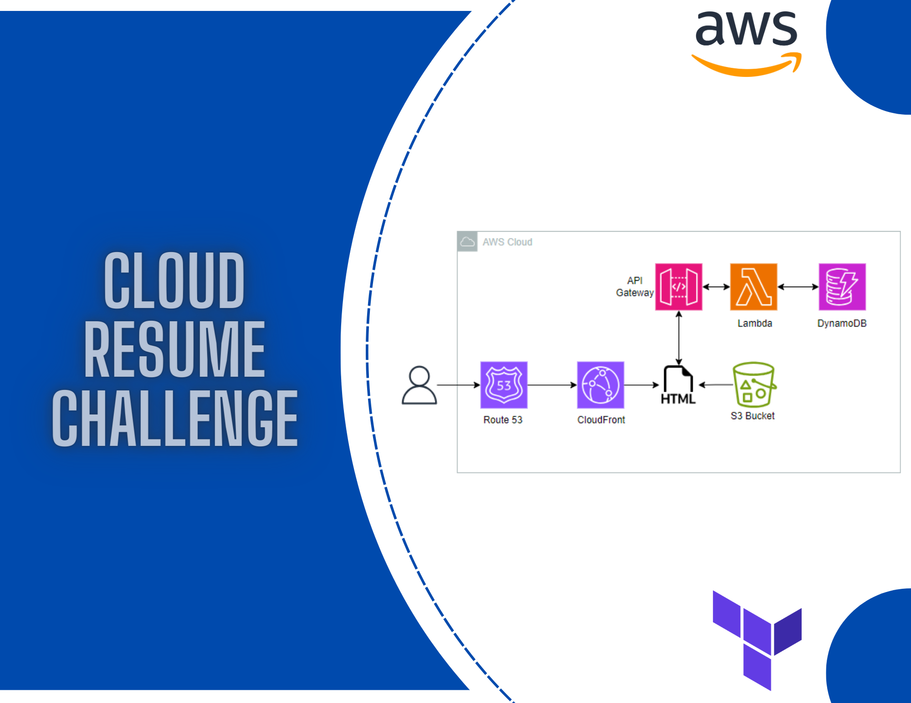

 

### About Me:

- Enthusiastic cloud engineering learner with a background in Telecommunications, eager to transition into Cloud Roles.
- Actively engaged in creating labs and small projects utilizing AWS services and Terraform.
- Currently immersed in studying AWS Machine Learning through SageMaker.
- Continuously honing Python skills to enhance proficiency and versatility in cloud development.

 

### Skills:

	
	
	
	
	
	

 

### Labs:

 

<table align="left" >
<tr border="none">
    <td width="25%" align="center">
    

     
      

    </td>
    <td width="25%" align="center">
    

     
      

    </td>
</tr>
</table>

 

### Projects:

 

<table align="left" >
<tr border="none">
    <td width="25%" align="center">
    

     
      

    </td>
    <td width="25%" align="center">
    

     
      

    </td>
</tr>
</table>